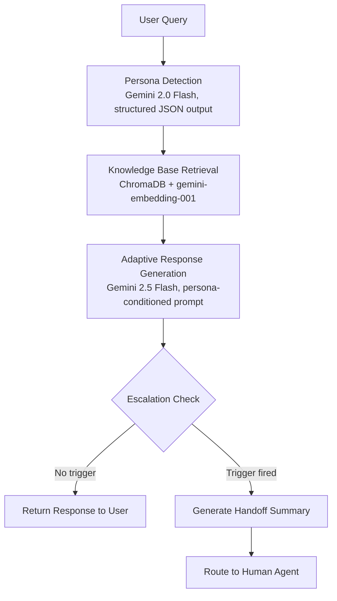

# Persona-Adaptive Customer Support Agent

An AI-powered customer support agent that detects a user's persona, retrieves grounded answers from a knowledge base using Retrieval-Augmented Generation (RAG), adapts its tone and depth to match the user, and escalates to a human agent — complete with a structured handoff summary — when the situation calls for it.

Built for the **Adsparkx AI — AI Engineering Intern** assignment.

---

## Table of Contents

- [Project Overview](#project-overview)
- [Tech Stack](#tech-stack)
- [Architecture](#architecture)
- [Features](#features)
- [Persona Detection Strategy](#persona-detection-strategy)
- [RAG Pipeline Design](#rag-pipeline-design)
- [Adaptive Response Generation](#adaptive-response-generation)
- [Escalation Logic](#escalation-logic)
- [Human Handoff Summary](#human-handoff-summary)
- [Project Structure](#project-structure)
- [Setup Instructions](#setup-instructions)
- [Environment Variables](#environment-variables)
- [Example Queries](#example-queries)
- [Known Limitations](#known-limitations--future-improvements)
- [Demo](#demo)

---

## Project Overview

Most support bots respond the same way to everyone — a frustrated user and a technical engineer get the same canned answer. This project fixes that by:

1. **Classifying** the incoming message into one of three personas: **Technical Expert**, **Frustrated User**, or **Business Executive**.
2. **Retrieving** the most relevant chunks from a knowledge base (support docs for a fictional SaaS product, *Nimbus Cloud Platform*) using a RAG pipeline backed by ChromaDB.
3. **Generating** a response that is grounded strictly in the retrieved content, with tone, depth, and structure adapted to the detected persona.
4. **Escalating** to a human agent — with a structured handoff summary — whenever the query falls outside what the knowledge base or the model can safely resolve.

The entire flow runs through an interactive **Streamlit** UI that shows the user's message, the detected persona, the retrieved sources, the generated response, and the escalation status in real time.

## Tech Stack

| Layer | Technology |
|---|---|
| Language | Python 3.11+ |
| LLM (persona classification) | Google Gemini — `gemini-2.0-flash` |
| LLM (response generation) | Google Gemini — `gemini-2.5-flash` |
| Embeddings | Google `gemini-embedding-001` |
| Vector Database | ChromaDB (persistent local store) |
| Document Chunking | LangChain `RecursiveCharacterTextSplitter` |
| Agent Orchestration | Custom Python (no agent framework — LangChain/LangGraph deliberately avoided in favor of explicit, debuggable control flow) |
| UI | Streamlit |
| Knowledge Base Format | Markdown (`.md`) + PDF |

> **Why no agent framework?** Persona detection → retrieval → generation → escalation is a fixed, linear pipeline with no dynamic tool-calling or multi-step planning required. A custom implementation keeps every decision point (especially escalation rules) explicit and easy to audit, rather than hidden inside framework abstractions.

## Architecture



**Text version (for non-Mermaid viewers):**

```
User Query
   │
   ▼
Persona Detection  (Gemini 2.0 Flash → JSON: persona, confidence, reasoning)
   │
   ▼
Knowledge Base Retrieval  (ChromaDB top-k search over embedded chunks)
   │
   ▼
Adaptive Response Generation  (Gemini 2.5 Flash, persona-specific prompt + retrieved context)
   │
   ▼
Escalation Check  (rule-based: sensitive topics / frustration / no retrieval results)
   │
   ├── No escalation ─────────────► Response shown to user
   │
   └── Escalation triggered ─────► Structured handoff summary ─────► Human agent
```

## Features

- ✅ Persona detection across 3 categories with structured JSON output
- ✅ RAG pipeline with semantic chunking, embeddings, and metadata-aware retrieval
- ✅ Tone- and depth-adaptive response generation, grounded only in retrieved content
- ✅ Rule-based escalation engine with configurable triggers
- ✅ Structured human handoff summary generation
- ✅ Interactive Streamlit chat UI showing persona, sources, response, and escalation status live
- ✅ Knowledge base of 11 realistic support documents (10 Markdown + 1 PDF) for a fictional SaaS product

## Persona Detection Strategy

**Method:** LLM-based classification (not keyword matching) using `gemini-2.0-flash` with a constrained, structured JSON output schema. A lightweight, fast model is used here deliberately since classification doesn't need the reasoning depth of the generation step, keeping per-message latency low.

**Output schema:**
```json
{
  "persona": "Technical Expert | Frustrated User | Business Executive",
  "confidence": 0.0,
  "reasoning": "short justification string"
}
```

**Prompt design principles:**
- The prompt provides explicit linguistic markers for each persona (e.g., technical terminology and requests for logs/configs → Technical Expert; emotional language and repeated complaints → Frustrated User; outcome/impact-focused phrasing → Business Executive) rather than asking the model to invent its own criteria.
- The model is constrained to return **only** the three allowed persona labels — no open-ended categories — to keep downstream prompt selection deterministic.
- `confidence` is surfaced in the UI so low-confidence classifications are visible to the user/reviewer, even though confidence does not currently gate escalation (see [Escalation Logic](#escalation-logic)).

## RAG Pipeline Design

**1. Document Loading** — Support documents (`.md` and `.pdf`) are loaded from the `/data` directory covering 10 topics: password resets, API troubleshooting, account lockouts, billing policy, service outages, token expiration, user management, integration setup, subscription plans, security FAQ, and database errors.

**2. Chunking** — `RecursiveCharacterTextSplitter` (LangChain) splits documents along natural boundaries (headers → paragraphs → sentences) before falling back to fixed-size splits. Each chunk retains metadata:
- `source` — originating filename (e.g., `billing_policy.md`)
- `section` — nearest heading the chunk falls under (e.g., `"4. Refund Policy"`)

**3. Embedding** — Each chunk is embedded using Google's `gemini-embedding-001` model.

**4. Storage** — Embeddings and metadata are persisted in a local **ChromaDB** collection, avoiding the need for an external vector DB service.

**5. Retrieval** — At query time, the user's message is embedded with the same model and a top-k similarity search (cosine distance) is run against the ChromaDB collection. Retrieved chunks — along with their `source` and `section` metadata — are passed into the response generation prompt and also displayed in the UI as "Sources."

**Why this combination?** Using the same embedding model family (`gemini-embedding-001`) for both ingestion and query avoids embedding-space mismatch. ChromaDB was chosen over a hosted vector DB (Pinecone/Qdrant) since the knowledge base is small (10–20 documents) and a local persistent store removes an external dependency and cost for an assignment-scale project.

## Adaptive Response Generation

`gemini-2.5-flash` generates the final response using a prompt that includes: the detected persona, the retrieved chunks (with source attribution), and persona-specific style instructions:

| Persona | Style Instructions |
|---|---|
| Technical Expert | Detailed, technical language; include root-cause explanation and step-by-step troubleshooting where the knowledge base supports it |
| Frustrated User | Empathetic opening, simple language, reassuring tone, action-oriented next steps |
| Business Executive | Concise, impact-focused, minimal jargon, includes resolution-time guidance where available |

The prompt explicitly instructs the model to **answer only from the retrieved context** and to state that information isn't available rather than fabricate an answer when retrieval returns nothing relevant — this is also one of the escalation triggers below.

## Escalation Logic

Escalation is **rule-based**, not LLM-judged, so that triggers are deterministic, auditable, and easy to tune without retraining a classifier. A conversation is escalated to a human agent when **any** of the following is true:

```
No relevant documents retrieved
    OR
Sensitive topic detected (billing, refunds, legal issues, duplicate charges)
    OR
High frustration indicators detected in user language
```

Concretely, the engine checks for:

| Trigger Category | Examples |
|---|---|
| **No retrieval results** | Similarity search returns zero chunks above the relevance cutoff for the query |
| **Billing / refund** | Keywords related to charges, refunds, duplicate billing, payment disputes |
| **Legal** | Keywords related to legal threats, compliance, contracts, liability |
| **Frustration** | Repeated complaints, escalatory/emotional language patterns associated with the Frustrated User persona |

> **Note on thresholds:** The current implementation uses keyword/condition-based rules rather than a numerical retrieval-confidence score (e.g., a cosine-similarity cutoff). This is a known simplification — see [Known Limitations](#known-limitations--future-improvements).

## Human Handoff Summary

When escalation triggers, a structured JSON summary is generated for the human agent:

```json
{
  "persona": "Frustrated User",
  "issue": "Unable to reset password after multiple attempts",
  "documents_used": [
    "password_reset_guide.pdf",
    "account_lockout.md"
  ],
  "attempted_steps": [
    "Sent password reset link",
    "Checked spam folder guidance",
    "Confirmed account not in security hold"
  ],
  "recommendation": "Verify identity and check for repeated reset requests indicating possible account-takeover attempt"
}
```

This summary, the full conversation history, and the detected persona are all shown in the Streamlit UI when an escalation occurs.

## Project Structure

```
persona-support-agent/
│
├── app.py                     # Streamlit UI entry point
├── persona_detector.py        # Gemini-based persona classification
├── rag_pipeline.py            # Chunking, embedding, ChromaDB retrieval
├── response_generator.py      # Persona-conditioned response generation
├── escalation.py              # Rule-based escalation logic + handoff summary
├── ingest.py                  # One-time script to build the ChromaDB index from /data
├── data/                      # Knowledge base (10 .md files + 1 .pdf)
├── chroma_db/                 # Persisted vector store (generated by ingest.py)
├── requirements.txt
├── .env.example
└── README.md
```

> Adjust file names above to match your actual repo layout if they differ.

## Setup Instructions

```bash
# 1. Clone the repository
git clone https://github.com/<your-username>/persona-support-agent.git
cd persona-support-agent

# 2. Create and activate a virtual environment
python3 -m venv venv
source venv/bin/activate        # On Windows: venv\Scripts\activate

# 3. Install dependencies
pip install -r requirements.txt

# 4. Configure environment variables
cp .env.example .env
# then edit .env and add your GOOGLE_API_KEY

# 5. Build the knowledge base index (run once, or whenever /data changes)
python ingest.py

# 6. Launch the Streamlit app
streamlit run app.py
```

The app will be available at `http://localhost:8501`.

## Environment Variables

| Variable | Required | Description |
|---|---|---|
| `GOOGLE_API_KEY` | Yes | API key for Google Gemini (used for both LLM calls and embeddings) |
| `PERSONA_MODEL` | No | Defaults to `gemini-2.0-flash` |
| `RESPONSE_MODEL` | No | Defaults to `gemini-2.5-flash` |
| `EMBEDDING_MODEL` | No | Defaults to `gemini-embedding-001` |
| `CHROMA_PERSIST_DIR` | No | Defaults to `./chroma_db` |
| `TOP_K_RESULTS` | No | Number of chunks retrieved per query; defaults to `4` |

**Never commit your `.env` file or API key to GitHub** — `.env` is included in `.gitignore`.

## Example Queries

| # | Query | Expected Persona | Expected Behavior |
|---|---|---|---|
| 1 | "Can you explain why I'm getting a 401 invalid_token error and how token refresh works?" | Technical Expert | Detailed, technical answer citing `api_troubleshooting.md` / `token_expiration.md` |
| 2 | "I've tried resetting my password three times and NOTHING is working, this is so frustrating!" | Frustrated User | Empathetic, simple, action-oriented answer from `password_reset_guide.pdf`; flagged for frustration |
| 3 | "How does the recent outage impact our SLA credits and when will service be fully restored?" | Business Executive | Concise, impact-focused answer from `service_outage.md` |
| 4 | "I was charged twice for my subscription this month and I want a refund." | Frustrated User / Business Executive (borderline) | Retrieves `billing_policy.md`, but **escalates** due to billing/duplicate-charge trigger |
| 5 | "What's your policy on data retention after account deletion, and is Nimbus HIPAA compliant?" | Technical Expert / Business Executive (borderline) | Answers from `security_faq.md`; escalates only if framed as a legal/compliance demand |
| 6 | "Does Nimbus support quantum-encrypted blockchain integrations?" | Any | No relevant documents retrieved → **escalates** automatically |

## Known Limitations & Future Improvements

- **No numerical retrieval-confidence threshold:** Escalation currently relies on keyword/condition rules rather than a cosine-similarity score cutoff. A future version could escalate automatically when the top retrieved chunk's similarity score falls below a tuned threshold, in addition to the existing rules.
- **No multi-turn memory persistence across sessions:** Conversation context is held in the Streamlit session state and is lost on page refresh; a persistent store (SQLite/Redis) would allow resuming conversations.
- **Frustration detection is rule/keyword-based:** A dedicated sentiment-analysis model could catch frustration signals phrased without obvious keywords.
- **Single-language support:** Persona detection and response generation prompts are tuned for English; multilingual support is untested.
- **No feedback loop:** There is currently no mechanism for a human agent to confirm/correct an escalation decision and feed that back into the rules.

## Demo

📹 Screen recording: `<insert Loom/YouTube link here>`
🔗 Live app (if deployed): `<insert Streamlit Cloud link here>`

---

Built as part of the Adsparkx AI AI Engineering Intern technical assignment.
